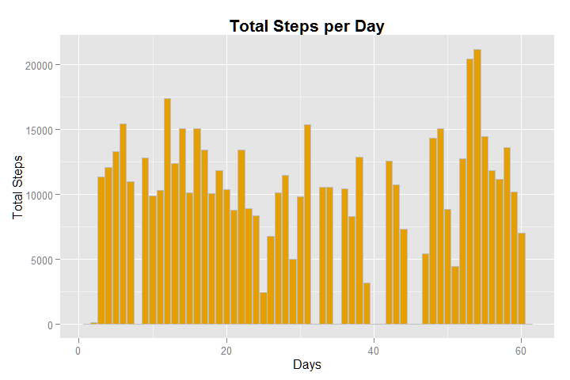
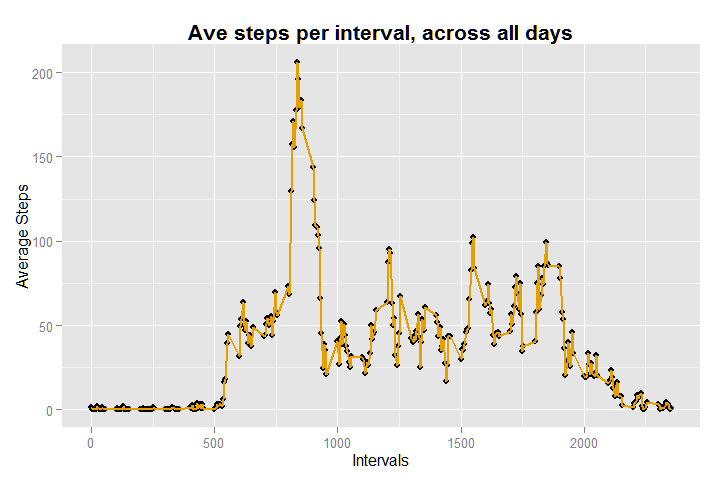
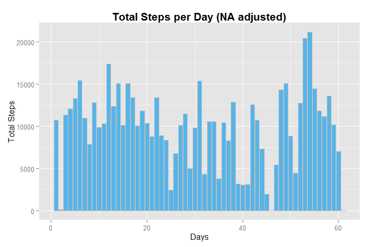
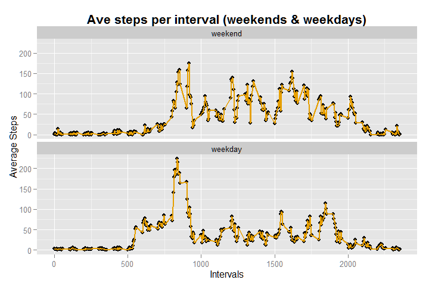

# Reproducible Research: Peer Assessment 1

## Loading and preprocessing the data
The data for this assignment was downloaded from the course web site at: 

* Dataset: [Activity monitoring data](https://d396qusza40orc.cloudfront.net/repdata%2Fdata%2Factivity.zip).[52K]

The dataset was stored in a comma-separated-value (CSV) file, *activity.csv*. 
There are a total of 17,568 observations in this dataset. The variables included 
in this dataset are: 

* steps: Number of steps taking in a 5-minute interval (missing values are coded as NA )  
* date: The date on which the measurement was taken in YYYY-MM-DD format  
* interval: Identifier for the 5-minute interval in which measurement was taken 

The code below reads in the downloaded *activity.csv* file.   The code also 
installs the libraries used to process and analyse the data.


```r
# Install packages (as necessary) and libraries
#install.packages("ggplot2")
#install.packages("plyr")
#install.packages("reshape")

library(ggplot2)
library(plyr)
library(reshape)
```

```
## 
## Attaching package: 'reshape'
## 
## The following objects are masked from 'package:plyr':
## 
##     rename, round_any
```

```r
## READ Data
df <- read.csv("data/activity.csv")
```

## What is mean total number of steps taken per day?
Process the data to calculate the total steps per day and display a histogram. 


```r
# Calculate and plot total steps each day
steps_total <- ddply(df, "date", summarise, total = sum(steps,na.rm = TRUE))  
steps_total$day_num <- c(1:61)

# Calculate mean and median total number of steps taken per day
median_steps <- median(steps_total$total, na.rm=TRUE)
mean_steps <- mean(steps_total$total, na.rm=TRUE)
median_steps <- round(signif(median_steps, 6))
mean_steps <- round(mean_steps)

# Bar Chart of steps per day
ggplot(steps_total, aes(x=day_num,y=total)) +
    geom_bar(stat="identity", fill="#E69F00", colour="grey") + 
    ggtitle("Total Steps per Day") + xlab("Days") + ylab("Total Steps") +
    theme(plot.title = element_text(size=16, face="bold"))
```

 


### Mean and medial total steps
The mean of the total number of steps taken per day is: 9354.  The median 
of the total number of steps taken per day is: 1.0395\times 10^{4}.


## What is the average daily activity pattern?

The code below processes the data and provides a time series plot which displays 
the 5-minute intervals (x-axis) and the average number of steps taken, averaged 
across all days (y-axis).


```r
# Process data to calcuate mean steps per interval across all days
mdata <- melt(df, id=c("interval","date"), na.rm=TRUE) 
mdata <- cast(mdata, interval~variable, mean)

# Interval with the maximum steps per day
colMax <- function(data) sapply(data, max, na.rm = TRUE)
max_interval <- colMax(mdata)

# Time series plot - Ave steps per interval across all days
ggplot(mdata, aes(x=interval,y=steps)) + 
    geom_point(color="black") +
    geom_line(colour="#E69F00", size=1) + 
    ggtitle("Ave steps per interval, across all days") + 
    xlab("Intervals") + ylab("Average Steps") +
    theme(plot.title = element_text(size=16, face="bold"))
```

 

### Interval with maximum steps

The 5-minute interval which contains the maximum number of steps on 
average across all the days in the dataset is: 2355.


## Imputing missing values

The dataset has a number of observations with missing values (coded as NA ). Missing data may introduce bias into some calculations or summaries of the data. 


```r
# Calculate and report the total number of rows with NAs
dfComplete <- df[complete.cases(df),]
NumNAs <- nrow(df) - nrow(dfComplete)
```

The **total number of missing values** in the dataset is: 2304.

### Strategy for filling in missing values.

The selected strategy for handling missing interval values was to fill it with the reasonably probable value of the 
calculated mean for the equivalent interval.

### Create new dataset and replace missing values

The code below copies the original dataset and then fills in the missing values.


```r
# Replace missing step values with the mean for the matching interval
dfAdj <- df
for (i in 1:61) { # days
    for (j in 1:288) { # intervals
        if (is.na(dfAdj$steps[i*j])) dfAdj$steps[i*j] <- mdata$steps[j]
    }
}
```


### The impact of imputing missing data

The histogram below displays the adjusted total number of steps taken each day after 
imputing data for all missing values.


```r
# Calculate and plot total ADJUSTED steps for each day
ADJsteps_total <- ddply(dfAdj, "date", summarise, total = sum(steps,na.rm = TRUE))  
ADJsteps_total$day_num <- c(1:61)

# Bar Chart of ADJUSTED steps per day
ggplot(ADJsteps_total, aes(x=day_num,y=total)) +
    geom_bar(stat="identity", fill="#56B4E9", colour="grey") + 
    ggtitle("Total Steps per Day (NA adjusted)") + xlab("Days") + ylab("Total Steps") +
    theme(plot.title = element_text(size=16, face="bold"))
```

 

```r
# Calculate mean and median total ADJUSTED number of steps taken per day
ADJmean_steps <- mean(ADJsteps_total$total, na.rm=TRUE)
ADJmedian_steps <- median(ADJsteps_total$total, na.rm=TRUE)
ADJmean_steps <- round(ADJmean_steps)
ADJmedian_steps <- round(signif(ADJmedian_steps, 6))
```

The calculated mean and median for the total number of steps taken per day, both with missing data and after
replacing the missing values, are shown below.  Comparison of the 
of the two sets of mean and median values indicate that the impact of imputing the missing data was an increase in the average number of steps taken per day. 

**Missing Data** 

* Mean: 9354
* Median: 1.0395\times 10^{4}           
           
**Imputed Data** 

* Mean: 9928 
* Median: 1.0439\times 10^{4} 

## Are there differences in activity patterns between weekdays and weekends?

To explore if there were any differences in activity patterns for days of the week,
a new factor level was added to the adjusted dataset to indicate whether a given 
observation was on a weekday or weekend.


```r
# Create new factor variable to indicate if day is a weekday or weekend
dfAdj$weekday = vector(mode="integer", length=nrow(dfAdj))
for (i in 1:nrow(dfAdj)) { 
    dfAdj$weekday[i] <- ifelse (weekdays(as.Date(dfAdj$date[i])) == "Sunday" | 
        weekdays(as.Date(dfAdj$date[i])) == "Saturday", 0, 1)
}
dfAdj$weekday = factor(dfAdj$weekday, c(0,1), c("weekend","weekday"))

# Time series plot - Ave steps per interval (weekends & weekdays)
wdata <- ddply(dfAdj, .(interval,weekday), summarise, steps = mean(steps,na.rm = TRUE))
ggplot(wdata, aes(x=interval,y=steps)) + 
    geom_point(color="black") +
    geom_line(colour="#E69F00", size=1) + 
    facet_wrap(~weekday,nrow=2) +
    ggtitle("Ave steps per interval (weekends & weekdays)") + 
    xlab("Intervals") + ylab("Average Steps") +
    theme(plot.title = element_text(size=16, face="bold"))
```

 
